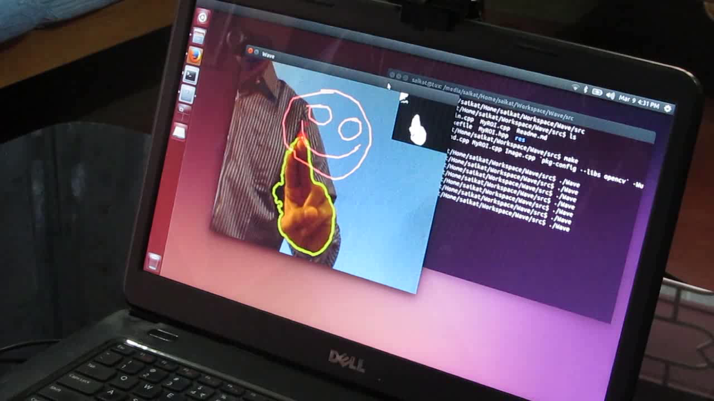
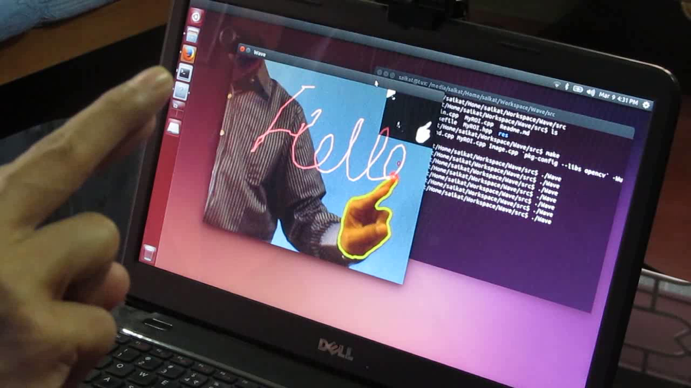
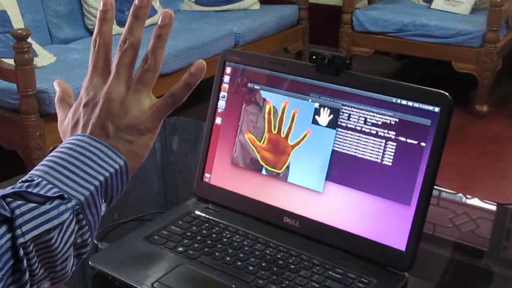
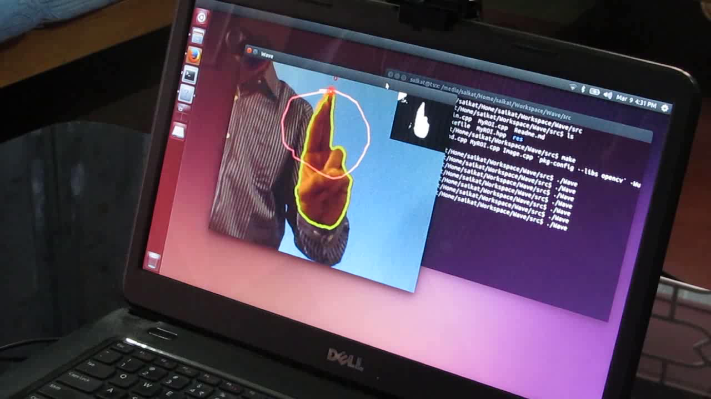

Wave : A Perceptive User Interface
===============================================

--------------------------
Wave is a perceptive user interface capable of detecting human hands, and
interpreting hand gestures as control instructions in real-time.

NOTE: This is an ongoing project.

Images
--------------------------

> Live long and may the source be with you. :octocat:
